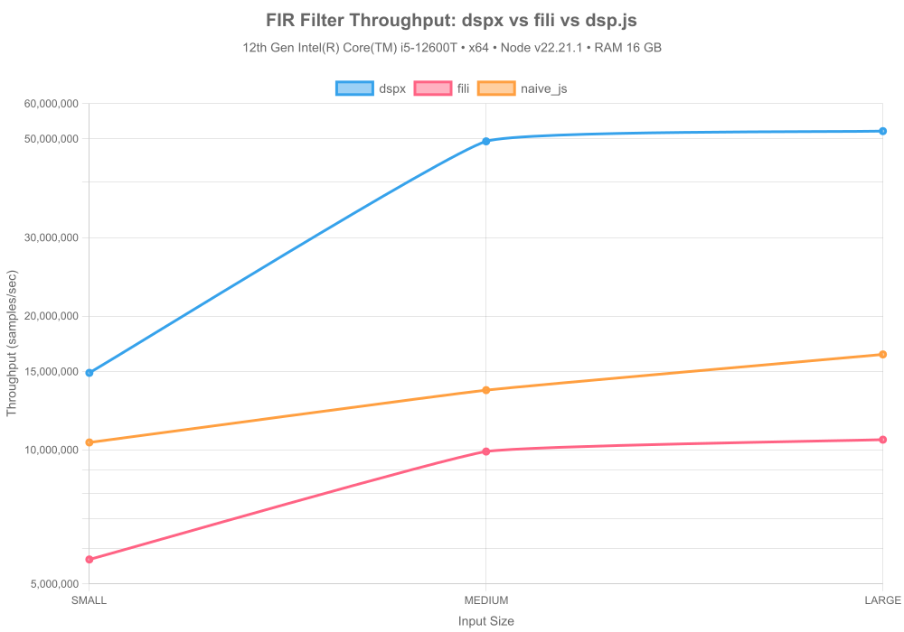
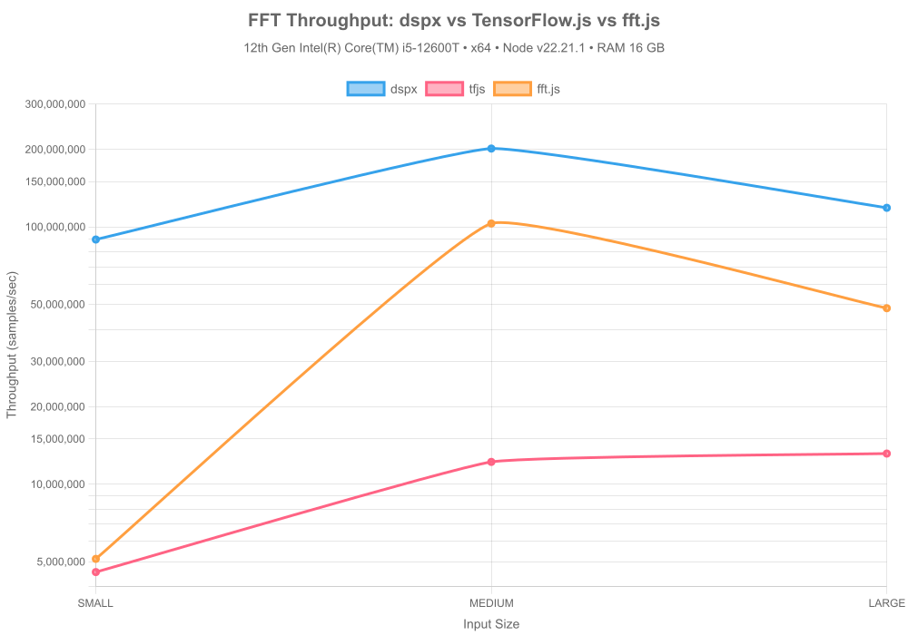
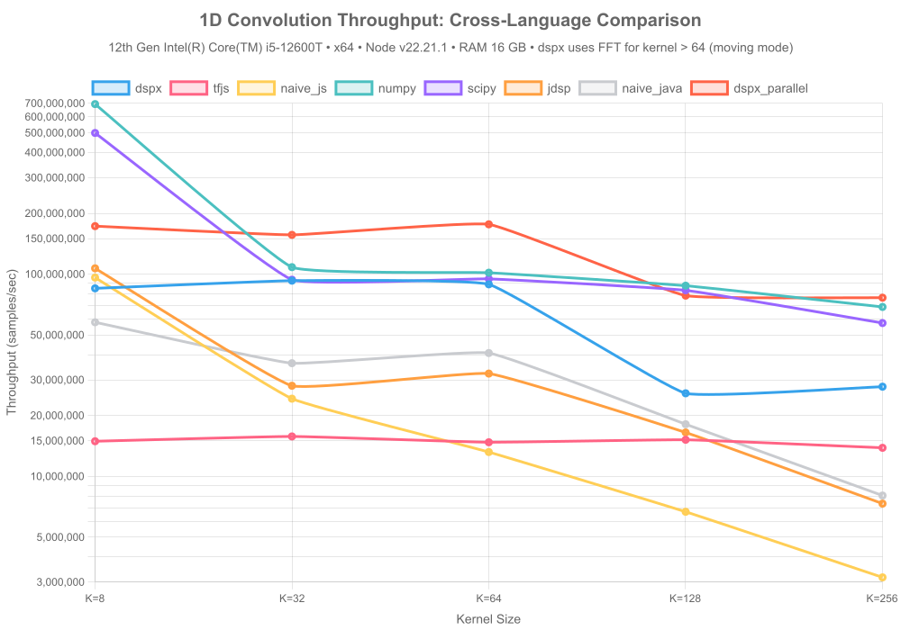
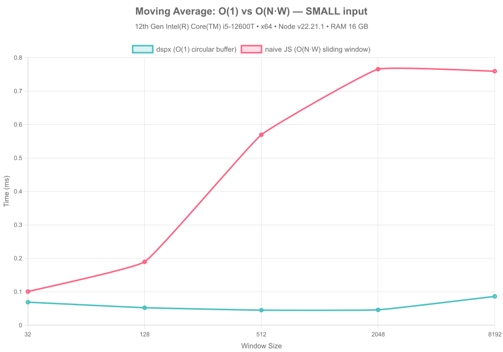
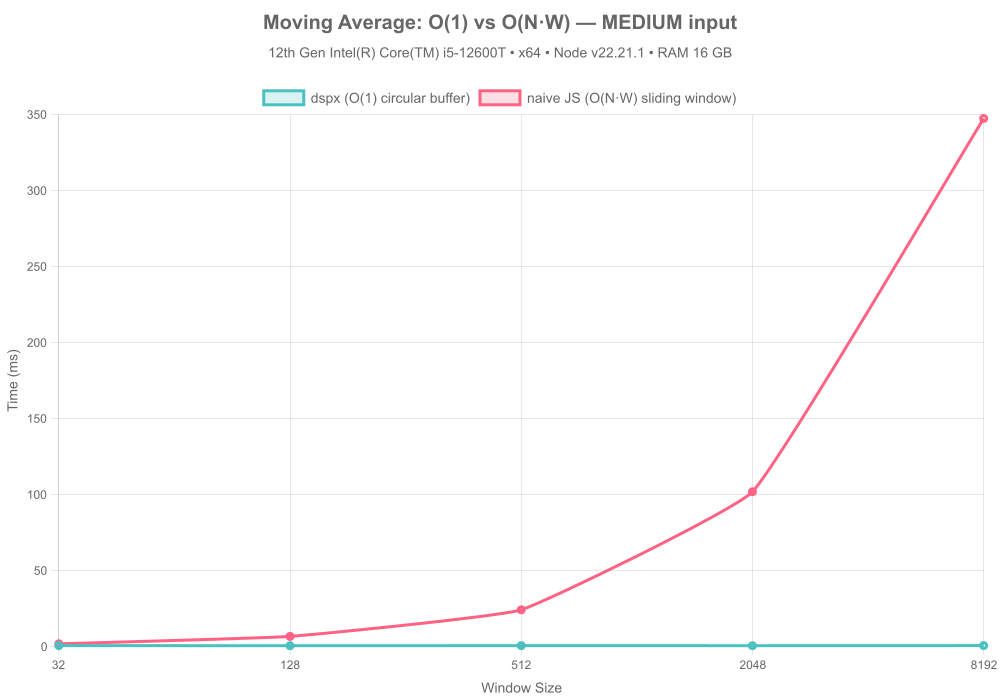
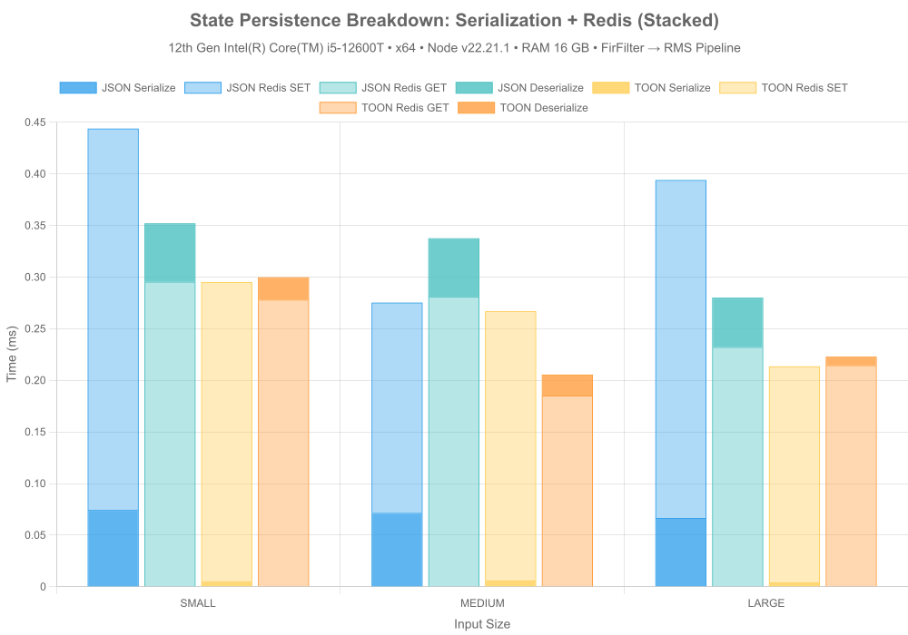
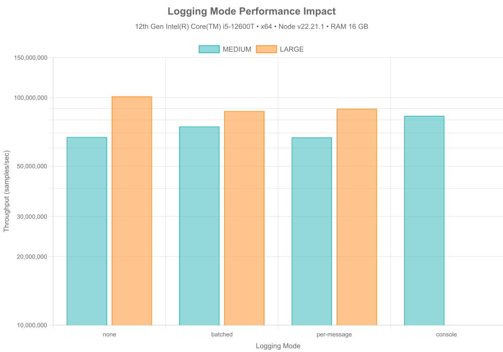

# dspx Benchmark Suite

Comprehensive performance benchmarks for the **dspx** library, comparing native C++ SIMD implementations against pure JavaScript and TensorFlow.js (CPU) across multiple performance dimensions.

## Quick Start

```bash
# Install dependencies
npm install

# Run all benchmarks + generate charts + create report
npm run bench:all

# Or run individual stories
npm run bench:speed      # Raw computational speed
npm run bench:algo       # Algorithmic efficiency
npm run bench:redis      # Redis state persistence
npm run bench:logging    # Logging performance

# Generate charts only (requires existing results)
npm run charts

# Generate markdown report only
npm run report
```

## Benchmarks

### Raw Computational Speed

Compares FFT and FIR filter implementations:

- **dspx**: Native C++ SIMD (N-API)
- **TensorFlow.js**: CPU backend (tfjs-node)
- **Pure JS**: fft.js, dsp.js

**Key Metric**: Throughput (samples/sec)


_Windows x64 results_


_Windows x64 results_


_Windows x64 results_

### Algorithmic Efficiency

Demonstrates O(1) circular buffer vs O(N·W) naive sliding window for moving averages.

**Key Metric**: Execution time vs window size


_Windows x64 results_


_Windows x64 results_

### Redis Resilience

Tests state save/load operations for crash recovery with seamless processing continuation.

**Key Metric**: Serialization latency, state size


_Windows x64 results_

### Production Logging

Compares logging mode overhead:

- No logging (baseline)
- Batched with TopicRouter (recommended)
- Per-message callbacks
- Naive console.log (anti-pattern)

**Key Metric**: Throughput overhead (%)


_Windows x64 results_

## Input Sizes

| Name   | Samples   | Description       |
| ------ | --------- | ----------------- |
| small  | 1,024     | Fits in L1 cache  |
| medium | 65,536    | Fits in L3 cache  |
| large  | 1,048,576 | Main-memory scale |

## Output Files

Results are organized by CPU name (auto-detected from `os.cpus()[0].model` or set via `BENCHMARK_PLATFORM` env var):

```
├── results/
│   ├── amd-ryzen-9-5900x-12-core-processor/      # AMD Ryzen 9 5900X results
│   │   ├── raw-speed.json
│   │   ├── algorithmic.json
│   │   ├── redis.json
│   │   └── logging.json
│   ├── tensor-g4/              # Google Tensor G4 results
│   │   └── ...
│   └── ...                   # Other CPU results
│
├── charts/
│   ├── amd-ryzen-9-5900x-12-core-processor/      # AMD Ryzen 9 5900X charts
│   │   ├── fft_throughput.png
│   │   ├── fir_throughput.png
│   │   ├── moving_avg_small.png
│   │   ├── moving_avg_medium.png
│   │   ├── redis_latency.png
│   │   └── logging_perf.png
│   ├── tensor-g4/              # Google Tensor G4 charts
│   │   └── ...
│   └── ...                   # Other CPU charts
├── reports/
│   ├── BENCHMARKS-amd-ryzen-9-5900x.md     # AMD Ryzen 9 5900X report
│   ├── BENCHMARKS-tensor-g4.md             # Google Tensor G4 report
│   └── ...                                 # Other CPU reports
```

## Requirements

- Node.js ≥ 18
- Redis (required for redis benchmarks)
- ~2GB RAM for large input tests

## Platform-Specific Results

The benchmark suite automatically organizes results by CPU name to enable easy cross-platform comparisons:

- **Auto-detection**: Results saved to `results/{sanitized-cpu-name}/`
  - CPU name is extracted from `os.cpus()[0].model`
  - Sanitized: lowercase, spaces to dashes, special chars removed
  - Example: "AMD Ryzen 9 5900X" → `amd-ryzen-9-5900x`
  - Example: "Tensor G4" → `tensor-g4`
- **Custom naming**: Set `BENCHMARK_PLATFORM` environment variable to override
  - Example: `BENCHMARK_PLATFORM="my-custom-device-name"`

All results include machine specifications embedded in JSON and chart subtitles:

- CPU model
- Core count
- RAM size
- OS version
- Node.js version
- dspx version

## Notes

- All benchmarks are **CPU-only** (no GPU/CUDA)
- TensorFlow.js uses CPU backend (`tfjs-node`)
- Warmup runs ensure JIT optimization
- Multiple repetitions for statistical reliability
- Results saved as JSON for custom analysis

## Example Results

```json
{
  "test": "fft",
  "input": "medium",
  "samples": 65536,
  "lib": "dspx",
  "avg_ms": 3.1,
  "throughput": 21140000,
  "backend": "CPU (Native C++ SIMD)",
  "meta": {
    "cpu": "AMD Ryzen 9 5900X",
    "cores": 24,
    "ram": "64 GB",
    "node": "v22.0.0",
    "dspx": "0.2.0-alpha.7"
  }
}
```

## Contributing

To add new benchmarks:

1. Create `storyN-name.js` following existing patterns
2. Use helpers from `common.js`
3. Save results with `saveJSON()`
4. Update `generate-charts.js` to visualize
5. Update `generate-report.js` to document
6. Add script to `package.json`
