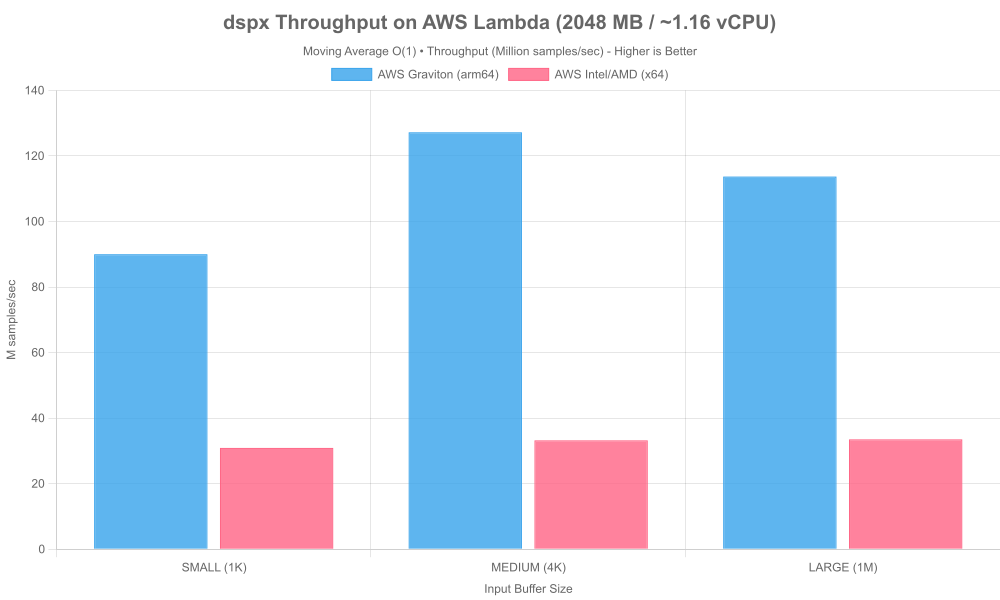
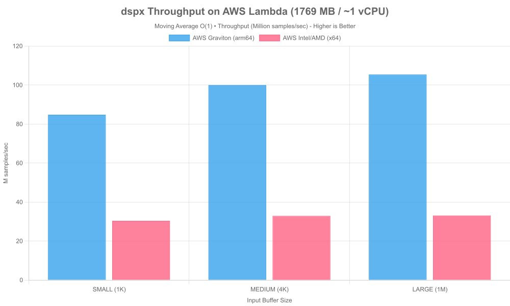
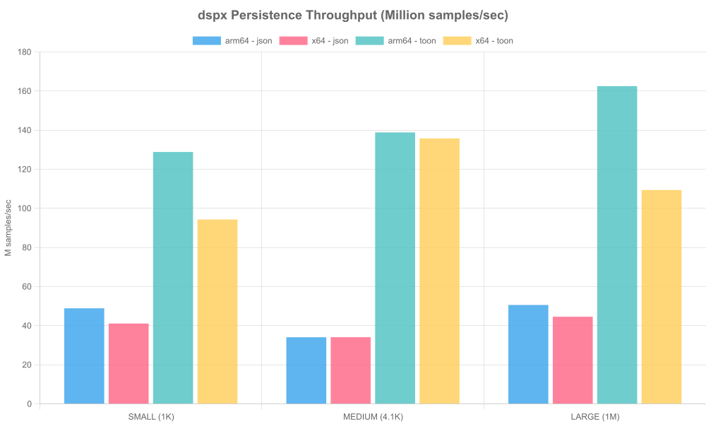
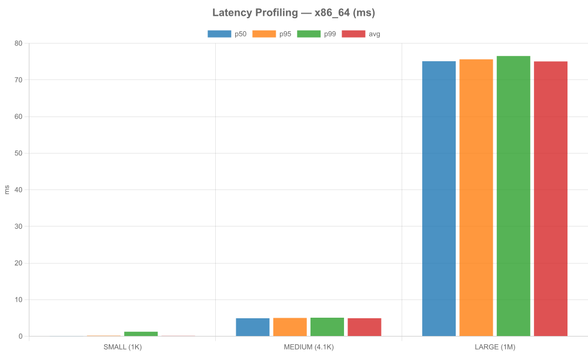
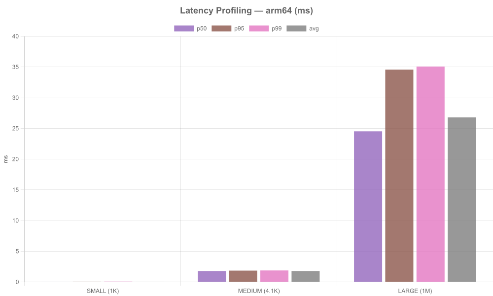
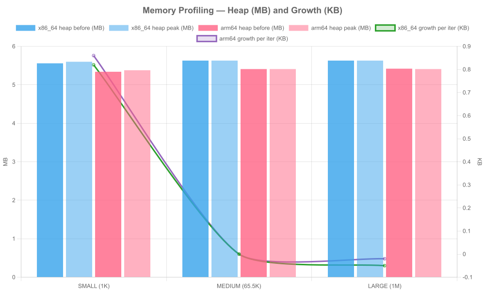

# DSP Benchmark Suite

> **SciPy on Lambda is a dead end. dspx isn't.**

The conventional approach to cloud DSP — SciPy + overprovisioned EC2 — has two fundamental problems: you can't run SciPy on Lambda without significant workarounds, and even if you could, the cold start latency makes it unsuitable for real-time workloads. So teams provision EC2 instances 24/7 "just in case," paying for idle compute around the clock.

dspx breaks that constraint:

- **1.1–13MB deploy size** (architecture-dependent) — fits comfortably within Lambda limits
- **240ms cold start** — viable for real-time invocations
- **112.8M samples/sec on Graviton (1 vCPU)** — outperforms scipy even on a fraction of the hardware
- **Microsecond state serialization** — filter histories, coefficients, and pipeline state persist across Lambda invocations via ElastiCache/MSK, so you pay only for actual compute time, not idle reservation

The result: DSP workloads that previously required dedicated clusters can run serverless, at a fraction of the cost.

---

## Cloud Performance (AWS Lambda)

| Architecture         | 1K Samples  | 1M Samples       |
| :------------------- | :---------- | :--------------- |
| **Graviton (arm64)** | 19.8M s/sec | **112.8M s/sec** |
| **Intel/AMD (x64)**  | 13.4M s/sec | 29.2M s/sec      |

> **Why Graviton dominates at scale:** Lambda Graviton is not consumer ARM — it is not thermally throttled. The ~3.8x throughput advantage over x64 at large buffer sizes reflects superior memory bandwidth and physical core isolation in the Lambda environment, not architectural bias. If you are choosing Lambda architecture, choose arm64.


_AWS Lambda 2 GB RAM results — Inputs: SMALL (1K), MEDIUM (4K), LARGE (1M)_


_AWS Lambda 1.769 GB (1 vCPU) RAM results — Inputs: SMALL (1K), MEDIUM (4K), LARGE (1M)_


_Persistence throughput (json vs toon) — Million samples/sec • Inputs: SMALL (1K), MEDIUM (4K), LARGE (1M)_


_Latency profiling (x86_64) — p50/p95/p99/avg (ms) • Inputs: SMALL (1K), MEDIUM (4K), LARGE (1M)_


_Latency profiling (arm64) — p50/p95/p99/avg (ms) • Inputs: SMALL (1K), MEDIUM (4K), LARGE (1M)_


_Heap before/peak (MB) and growth per iter (KB) • Inputs: SMALL (1K), MEDIUM (4K), LARGE (1M)_

---

## Quick Start

```bash
# Install dependencies
npm install

# Run all benchmarks + generate charts + create report
npm run benchmarks

# Or run individual stories
npm run bench:speed      # Raw computational speed (JS)
npm run bench:algo       # Algorithmic efficiency (JS)
npm run bench:speed-py   # Raw computational speed (Python)
npm run bench:algo-py    # Algorithmic efficiency (Python)
npm run bench:speed-java # Raw computational speed (Java)
npm run bench:algo-java  # Algorithmic efficiency (Java)
npm run bench:redis      # Redis state persistence
npm run bench:logging    # Logging performance

# Generate charts only (requires existing results)
npm run charts

# Generate markdown report only
npm run report
```

---

## Benchmarks

### Raw Computational Speed

Compares FFT, FIR filter, and convolution implementations across languages:

- **JavaScript**: dspx (Native C++ SIMD), TensorFlow.js (CPU), fft.js, fili, naive implementations
- **Python**: numpy, scipy
- **Java**: JDSP, naive implementations

**Key Metric**: Throughput (samples/sec)


_Windows x64 results_


_Windows x64 results_


_Windows x64 results_

### Algorithmic Efficiency

Demonstrates O(1) circular buffer vs O(N·W) naive sliding window for moving averages across languages.

- **JavaScript**: dspx, naive implementations
- **Python**: scipy (uniform filter), numpy (convolve)
- **Java**: JDSP (efficient), naive implementations

**Key Metric**: Execution time vs window size


_Windows x64 results_


_Windows x64 results_

### Redis State Persistence

dspx pipelines serialize their full state — filter coefficients, buffer histories, intermediate values — to Redis in microseconds. This is what enables stateful DSP on stateless infrastructure. A Lambda function can pick up exactly where the previous invocation left off, with no reinitialization penalty.

**Key Metric**: Serialization latency, state size


_Windows x64 results_

### Production Logging

Compares logging mode overhead:

- No logging (baseline)
- Batched with TopicRouter (recommended)
- Per-message callbacks
- Naive console.log (anti-pattern)

**Key Metric**: Throughput overhead (%)


_Windows x64 results_

---

## Input Sizes

| Name   | Samples   | Description       |
| ------ | --------- | ----------------- |
| small  | 1,024     | Fits in L1 cache  |
| medium | 65,536    | Fits in L3 cache  |
| large  | 1,048,576 | Main-memory scale |

---

## Output Files

Results are organized by CPU name (auto-detected from `os.cpus()[0].model` or set via `BENCHMARK_PLATFORM` env var):

```
├── results/
│   ├── amd-ryzen-9-5900x-12-core-processor/
│   │   ├── raw-speed.json
│   │   ├── algorithmic.json
│   │   ├── redis.json
│   │   └── logging.json
│   ├── tensor-g4/
│   │   └── ...
│   └── ...
│
├── charts/
│   ├── amd-ryzen-9-5900x-12-core-processor/
│   │   ├── fft_throughput.png
│   │   ├── fir_throughput.png
│   │   ├── convolution_throughput.png
│   │   ├── moving_avg_small.png
│   │   ├── moving_avg_medium.png
│   │   ├── moving_avg_large.png
│   │   ├── redis_latency.png
│   │   └── logging_perf.png
│   ├── tensor-g4/
│   │   └── ...
│   └── ...
├── reports/
│   ├── BENCHMARKS-amd-ryzen-9-5900x.md
│   ├── BENCHMARKS-tensor-g4.md
│   └── ...
```

---

## Platform-Specific Results

The benchmark suite automatically organizes results by CPU name:

- **Auto-detection**: Results saved to `results/{sanitized-cpu-name}/`
  - CPU name extracted from `os.cpus()[0].model`
  - Sanitized: lowercase, spaces to dashes, special chars removed
  - Example: "AMD Ryzen 9 5900X" → `amd-ryzen-9-5900x`
- **Custom naming**: Set `BENCHMARK_PLATFORM` environment variable to override

All results include machine specs embedded in JSON and chart subtitles: CPU model, core count, RAM, OS, Node.js version, dspx version.

---

## Requirements

- **Node.js** ≥ 18
- **Python** ≥ 3.8 (with numpy, scipy)
- **Java** ≥ 17 (with Maven)
- **Redis** (required for redis benchmarks)
- ~2GB RAM for large input tests

```bash
# JavaScript dependencies
npm install

# Python dependencies (optional)
pip install -r requirements.txt

# Java dependencies (optional)
mvn compile
```

---

## Example Results

**JavaScript (dspx):**

```json
{
  "test": "fft",
  "input": "medium",
  "samples": 65536,
  "lib": "dspx",
  "avg_ms": 3.1,
  "throughput": 21140000,
  "backend": "CPU (Native C++ SIMD)",
  "meta": {
    "cpu": "AMD Ryzen 9 5900X",
    "cores": 24,
    "ram": "64 GB",
    "node": "v22.0.0",
    "dspx": "0.2.0-alpha.7"
  }
}
```

**Python (scipy):**

```json
{
  "test": "moving_average",
  "input": "large",
  "samples": 1048576,
  "lib": "scipy",
  "avg_ms": 1129.7,
  "throughput": 928177,
  "impl": "uniform_filter_O1",
  "meta": {
    "cpu": "AMD Ryzen 9 5900X",
    "cores": 24,
    "ram": "64 GB",
    "os": "Windows 11 10.0",
    "python": "3.12.5"
  }
}
```

**Java (JDSP):**

```json
{
  "test": "fft",
  "input": "medium",
  "samples": 65536,
  "lib": "jdsp",
  "avg_ms": 2.33,
  "throughput": 28130000,
  "backend": "CPU (JDSP FFT)",
  "meta": {
    "cpu": "amd64 24 cores",
    "cores": 24,
    "ram": "15 GB",
    "os": "Windows 11 10.0",
    "java": "23.0.1"
  }
}
```

---

## Notes

- All benchmarks are **CPU-only** (no GPU/CUDA)
- TensorFlow.js uses CPU backend (`tfjs-node`)
- Results from all languages are automatically combined for cross-language comparisons
- Warmup runs ensure JIT optimization
- Multiple repetitions for statistical reliability
- Results saved as JSON for custom analysis

---

## Contributing

To add new benchmarks:

**JavaScript**: Create `storyN-name.js`, use helpers from `common.js`, save results with `saveJSON()`, update `generate-charts.js` and `generate-report.js`, add script to `package.json`.

**Python**: Create `storyN-name.py`, use helpers from `lib/common.py`, save results with `saveJSON()`. Results automatically integrate with existing charts/reports.

**Java**: Create `StoryNName.java`, use Gson for JSON serialization, save results with `saveJSON()`, add Maven exec configuration to `pom.xml`.

Results from all three languages are combined automatically for cross-language chart generation.
