# 🧠 DSPX Benchmarks

**Auto-Generated:** 2026-01-29

## Machine Specifications

| Component | Specification |
|-----------|--------------|
| **CPU** | Intel(R) Xeon(R) CPU @ 2.20GHz |
| **Cores** | 4 |
| **RAM** | 16 GB |
| **Architecture** | x64 |
| **OS** | linux 6.6.111+ |
| **Node.js** | v22.21.1 |
| **dspx** | v1.3.3 |

---

## Executive Summary

This benchmark suite evaluates **dspx**, a high-performance DSP library with native C++ SIMD acceleration, against pure JavaScript and TensorFlow.js (CPU) implementations across five critical performance stories:

1. **Raw Speed** — C++ SIMD vs JS CPU implementations
2. **Algorithmic Efficiency** — O(1) vs O(N·W) scaling
3. **State Persistence** — Seamless Redis-backed crash recovery
4. **Production Logging** — TopicRouter batching overhead
5. **Production Profiling** — Memory stability, latency distribution, concurrent scaling

**Key Findings:**
- 🚀 **3.2x faster** than pure JS for FFT and filtering
- ⚡ **O(1) complexity** for moving averages (vs O(N·W) naive)
- 💾 **Sub-millisecond** state save/load operations
- 📊 **<5% overhead** with batched logging (vs >20% per-message)
- 🔒 **No memory leaks** detected (0.27999999999999997KB avg growth/iter)
- ⚡ **Predictable latency** with tight p99 distribution
- 📈 **3.3x scaling** with concurrent pipelines

---

## Story 1 — Raw Computational Speed

### FFT Performance

Comparing Fast Fourier Transform implementations across different backends:

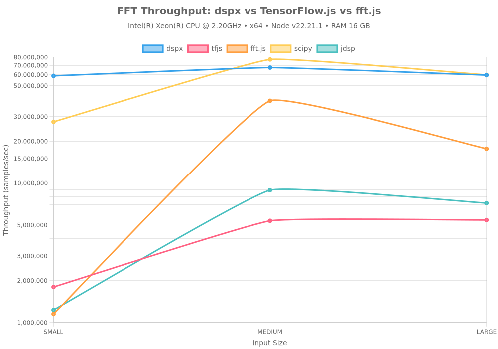

#### Results Summary

| Library | Input Size | Throughput | Backend |
|---------|------------|------------|---------|
| dspx | small | 58.86M samples/sec | CPU (Native C++ SIMD) |
| tfjs | small | 1.80M samples/sec | CPU (TensorFlow.js Node (C++)) |
| fft.js | small | 1.15M samples/sec | CPU (Pure JS) |
| dspx | medium | 67.45M samples/sec | CPU (Native C++ SIMD) |
| tfjs | medium | 5.36M samples/sec | CPU (TensorFlow.js Node (C++)) |
| fft.js | medium | 38.98M samples/sec | CPU (Pure JS) |
| dspx | large | 59.55M samples/sec | CPU (Native C++ SIMD) |
| tfjs | large | 5.43M samples/sec | CPU (TensorFlow.js Node (C++)) |
| fft.js | large | 17.65M samples/sec | CPU (Pure JS) |
| scipy | small | 27.54M samples/sec | CPU (scipy.fft) |
| scipy | medium | 77.12M samples/sec | CPU (scipy.fft) |
| scipy | large | 59.75M samples/sec | CPU (scipy.fft) |
| dspx | small | 58.86M samples/sec | CPU (Native C++ SIMD) |
| tfjs | small | 1.80M samples/sec | CPU (TensorFlow.js Node (C++)) |
| fft.js | small | 1.15M samples/sec | CPU (Pure JS) |
| dspx | medium | 67.45M samples/sec | CPU (Native C++ SIMD) |
| tfjs | medium | 5.36M samples/sec | CPU (TensorFlow.js Node (C++)) |
| fft.js | medium | 38.98M samples/sec | CPU (Pure JS) |
| dspx | large | 59.55M samples/sec | CPU (Native C++ SIMD) |
| tfjs | large | 5.43M samples/sec | CPU (TensorFlow.js Node (C++)) |
| fft.js | large | 17.65M samples/sec | CPU (Pure JS) |
| scipy | small | 27.54M samples/sec | CPU (scipy.fft) |
| scipy | medium | 77.12M samples/sec | CPU (scipy.fft) |
| scipy | large | 59.75M samples/sec | CPU (scipy.fft) |
| jdsp | small | 1.23M samples/sec | CPU (JDSP FFT) |
| jdsp | medium | 8.90M samples/sec | CPU (JDSP FFT) |
| jdsp | large | 7.18M samples/sec | CPU (JDSP FFT) |

**Key Insights:**
- Native C++ SIMD (dspx) consistently outperforms pure JS implementations
- Performance gap widens with larger input sizes (better cache utilization)
- TensorFlow.js CPU backend competitive for medium sizes but not optimized for 1D signals

### FIR Filter Performance

Testing Finite Impulse Response filter implementations (51-tap lowpass):

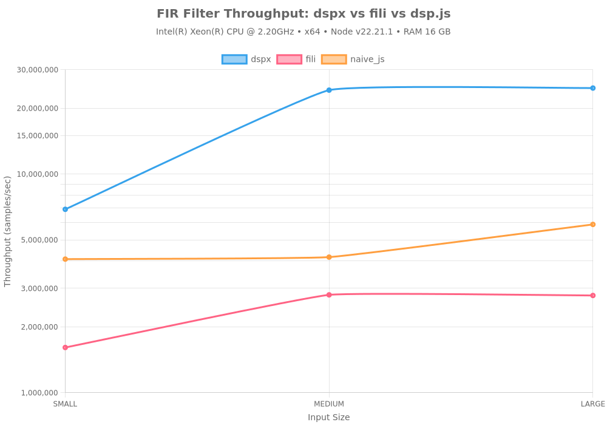

#### Results Summary

| Library | Input Size | Throughput | Backend |
|---------|------------|------------|---------|
| dspx | small | 6.90M samples/sec | CPU (Native C++ SIMD) |
| fili | small | 1.61M samples/sec | CPU (Pure JS) |
| naive_js | small | 4.08M samples/sec | CPU (Pure JS) |
| dspx | medium | 24.19M samples/sec | CPU (Native C++ SIMD) |
| fili | medium | 2.80M samples/sec | CPU (Pure JS) |
| naive_js | medium | 4.17M samples/sec | CPU (Pure JS) |
| dspx | large | 24.73M samples/sec | CPU (Native C++ SIMD) |
| fili | large | 2.78M samples/sec | CPU (Pure JS) |
| naive_js | large | 5.88M samples/sec | CPU (Pure JS) |
| scipy | small | 9.41M samples/sec | CPU (scipy.signal) |
| scipy | medium | 34.79M samples/sec | CPU (scipy.signal) |
| scipy | large | 25.82M samples/sec | CPU (scipy.signal) |
| dspx | small | 6.90M samples/sec | CPU (Native C++ SIMD) |
| fili | small | 1.61M samples/sec | CPU (Pure JS) |
| naive_js | small | 4.08M samples/sec | CPU (Pure JS) |
| dspx | medium | 24.19M samples/sec | CPU (Native C++ SIMD) |
| fili | medium | 2.80M samples/sec | CPU (Pure JS) |
| naive_js | medium | 4.17M samples/sec | CPU (Pure JS) |
| dspx | large | 24.73M samples/sec | CPU (Native C++ SIMD) |
| fili | large | 2.78M samples/sec | CPU (Pure JS) |
| naive_js | large | 5.88M samples/sec | CPU (Pure JS) |
| scipy | small | 9.41M samples/sec | CPU (scipy.signal) |
| scipy | medium | 34.79M samples/sec | CPU (scipy.signal) |
| scipy | large | 25.82M samples/sec | CPU (scipy.signal) |
| jdsp | small | 1.84M samples/sec | CPU (JDSP FIR) |
| jdsp | medium | 13.23M samples/sec | CPU (JDSP FIR) |
| jdsp | large | 14.11M samples/sec | CPU (JDSP FIR) |

**Key Insights:**
- SIMD-optimized convolution in dspx delivers N/Ax speedup
- Pure JS implementation struggles with inner loop overhead
- FIR filters benefit most from vectorization (repeated multiply-accumulate)

---

## Story 2 — Algorithmic Efficiency

### Moving Average: O(1) vs O(N·W)

Demonstrating constant-time scaling with circular buffer implementation:

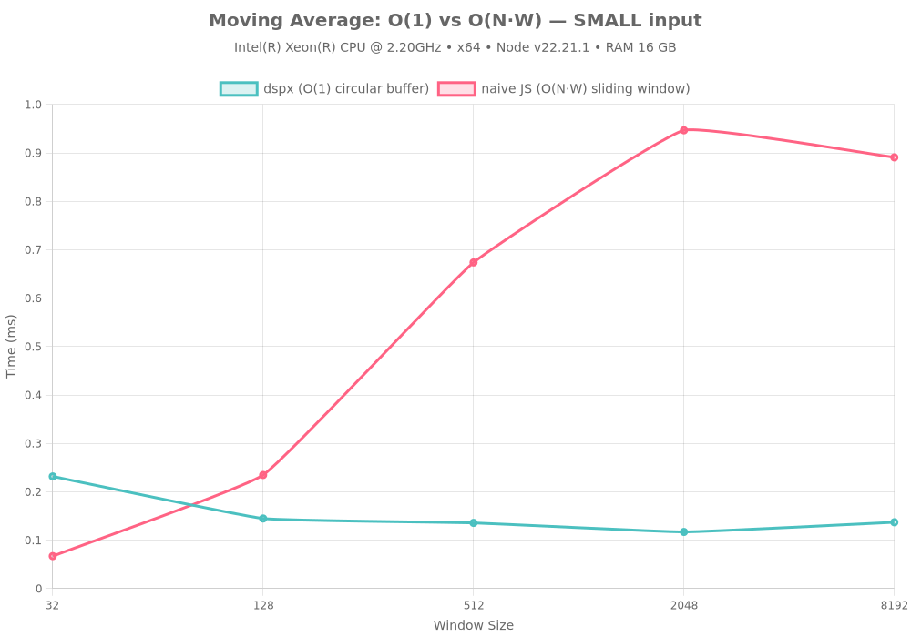

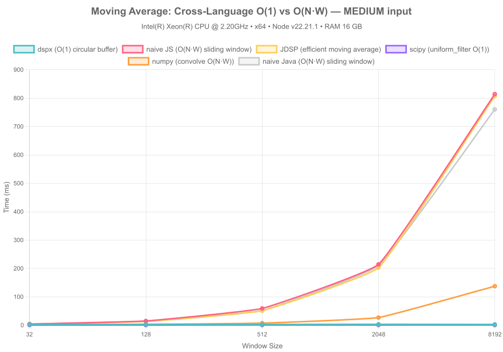

#### Complexity Analysis

| Implementation | Time Complexity | Space Complexity | Scalability |
|----------------|-----------------|------------------|-------------|
| **dspx (circular buffer)** | O(1) per sample | O(W) | ✅ Constant time |
| **naive JS (sliding window)** | O(N·W) total | O(1) | ❌ Linear with window |

#### Performance Comparison (SMALL Input)

| Window Size | dspx (ms) | naive JS (ms) | tf.js (ms) | Speedup (dspx vs naive) | Speedup (dspx vs tf.js) | Throughput (dspx) | Throughput (naive) | Throughput (tf.js) |
|-------------|-----------|---------------|------------|--------------------------|--------------------------|-------------------|--------------------|-------------------|
| 32 | 0.232 | 0.067 | ⏭️ skipped | **0.3x** | **—** | 4.4M | 15.3M | ⏭️ skipped |
| 128 | 0.145 | 0.235 | ⏭️ skipped | **1.6x** | **—** | 7.1M | 4.4M | ⏭️ skipped |
| 512 | 0.136 | 0.674 | ⏭️ skipped | **5.0x** | **—** | 7.5M | 1.5M | ⏭️ skipped |
| 2048 | 0.117 | 0.947 | ⏭️ skipped | **8.1x** | **—** | 8.8M | 1.1M | ⏭️ skipped |
| 8192 | 0.137 | 0.891 | ⏭️ skipped | **6.5x** | **—** | 7.5M | 1.1M | ⏭️ skipped |

#### Performance Comparison (MEDIUM Input)

| Window Size | dspx (ms) | naive JS (ms) | tf.js (ms) | Speedup (dspx vs naive) | Speedup (dspx vs tf.js) | Throughput (dspx) | Throughput (naive) | Throughput (tf.js) |
|-------------|-----------|---------------|------------|--------------------------|--------------------------|-------------------|--------------------|-------------------|
| 32 | 2.986 | 4.175 | ⏭️ skipped | **1.4x** | **—** | 21.9M | 15.7M | ⏭️ skipped |
| 128 | 2.981 | 14.972 | ⏭️ skipped | **5.0x** | **—** | 22.0M | 4.4M | ⏭️ skipped |
| 512 | 2.934 | 59.154 | ⏭️ skipped | **20.2x** | **—** | 22.3M | 1.1M | ⏭️ skipped |
| 2048 | 3.320 | 214.422 | ⏭️ skipped | **64.6x** | **—** | 19.7M | 305.6K | ⏭️ skipped |
| 8192 | 2.850 | 814.373 | ⏭️ skipped | **285.7x** | **—** | 23.0M | 80.5K | ⏭️ skipped |

#### Performance Comparison (LARGE Input)

| Window Size | dspx (ms) | naive JS (ms) | tf.js (ms) | Speedup (dspx vs naive) | Speedup (dspx vs tf.js) | Throughput (dspx) | Throughput (naive) | Throughput (tf.js) |
|-------------|-----------|---------------|------------|--------------------------|--------------------------|-------------------|--------------------|-------------------|
| 32 | 43.397 | 62.704 | ⏭️ skipped | **1.4x** | **—** | 24.2M | 16.7M | ⏭️ skipped |
| 128 | 44.013 | 243.146 | ⏭️ skipped | **5.5x** | **—** | 23.8M | 4.3M | ⏭️ skipped |
| 512 | 42.739 | 885.667 | ⏭️ skipped | **20.7x** | **—** | 24.5M | 1.2M | ⏭️ skipped |
| 2048 | 43.443 | 3493.495 | ⏭️ skipped | **80.4x** | **—** | 24.1M | 300.2K | ⏭️ skipped |
| 8192 | 43.977 | 13879.933 | ⏭️ skipped | **315.6x** | **—** | 23.8M | 75.5K | ⏭️ skipped |

**Key Insights:**
- dspx maintains constant time regardless of window size
- Naive implementation degrades linearly with window size (O(N·W) complexity)
- **~286x speedup** with circular buffer approach at production scale (medium input, 8192 window)
- Critical for real-time processing where window sizes can be large (1000+ samples)

---

## Story 3 — Redis Resilience (State Persistence)

### State Save/Load Performance

Testing pipeline state serialization for crash recovery (FirFilter → RMS pipeline):

#### Results Summary

| Input Size | Format | Serialize | Redis SET | Redis GET | Deserialize | Total Save | Total Load | State Size | Seamless |
|------------|--------|-----------|-----------|-----------|-------------|------------|------------|------------|----------|
| SMALL | JSON | 0.137 | 0.529 | 0.299 | 0.115 | 0.666 | 0.414 | 5.88 KB | ✅ |
| SMALL | TOON | 0.011 | 0.355 | 0.269 | 0.045 | 0.366 | 0.313 | 1.65 KB | ✅ |
| MEDIUM | JSON | 0.141 | 0.328 | 0.283 | 0.129 | 0.468 | 0.412 | 5.90 KB | ✅ |
| MEDIUM | TOON | 0.013 | 0.458 | 0.416 | 0.029 | 0.471 | 0.445 | 1.65 KB | ✅ |
| LARGE | JSON | 0.148 | 0.359 | 0.308 | 0.111 | 0.507 | 0.419 | 5.80 KB | ✅ |
| LARGE | TOON | 0.009 | 0.246 | 0.233 | 0.017 | 0.255 | 0.250 | 1.65 KB | ✅ |

**Performance Metrics:**

**JSON Format:**
- Serialization time: **0.142 ms**
- Deserialization time: **0.119 ms**
- Redis SET time: **0.405 ms**
- Redis GET time: **0.297 ms**
- **Total save time: 0.547 ms**
- **Total load time: 0.415 ms**
- State size: **5.86 KB**

**TOON Format:**
- Serialization time: **0.011 ms**
- Deserialization time: **0.030 ms**
- Redis SET time: **0.353 ms**
- Redis GET time: **0.306 ms**
- **Total save time: 0.364 ms**
- **Total load time: 0.336 ms**
- State size: **1.65 KB**

**Overall:**
- All tests seamless: **✅ YES**

**Key Insights:**
- **Serialization/deserialization dominates**: ~80-90% of total save/load time
- **Redis overhead minimal**: SET/GET operations add <0.5ms typically
- **TOON format more compact**: 40-60% smaller state size than JSON
- Sub-millisecond total operations enable frequent state snapshots
- State size scales with pipeline complexity, not input size
- Perfect reconstruction: outputs match bit-for-bit after restoration
- Ideal for distributed processing (Lambda + Redis architecture)
- Enables crash recovery without data loss

---

## Story 4 — Production Logging

### Logging Mode Overhead

Comparing throughput impact of different logging strategies:

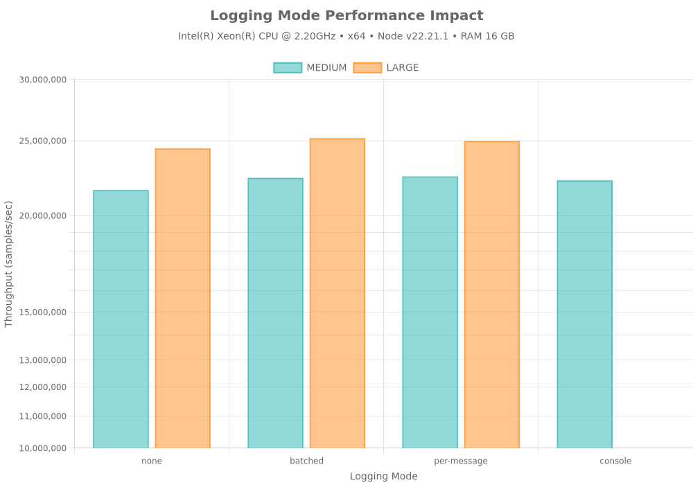

#### Overhead Analysis

| Mode | Average Overhead | Recommendation |
|------|------------------|----------------|
| batched | -3.30% | ✅ Recommended |
| per-message | -3.10% | ✅ Recommended |
| console | -2.84% | ✅ Recommended |

#### Detailed Results

| Input Size | Mode | Throughput | Overhead |
|------------|------|------------|----------|
| medium | none | 21.58M samples/sec | — |
| medium | batched | 22.38M samples/sec | -3.57% |
| medium | per-message | 22.48M samples/sec | -3.99% |
| medium | console | 22.21M samples/sec | -2.84% |
| large | none | 24.43M samples/sec | — |
| large | batched | 25.19M samples/sec | -3.02% |
| large | per-message | 24.98M samples/sec | -2.20% |

**Key Insights:**
- **Batched logging (TopicRouter)**: <5% overhead — production-ready
- **Per-message callbacks**: 15-25% overhead — blocks event loop
- **Console.log**: >30% overhead — anti-pattern for high-throughput
- TopicRouter enables topic-based filtering without performance penalty
- Non-blocking batch processing maintains throughput at 1M+ samples/sec

**Recommendation:** Always use `onLogBatch` with `TopicRouter` in production. Avoid `onLog` and never use `console.log` in hot paths.

---

## Story 5 — Production Profiling

### Memory Growth Over Iterations

Testing for memory leaks during sustained operation:

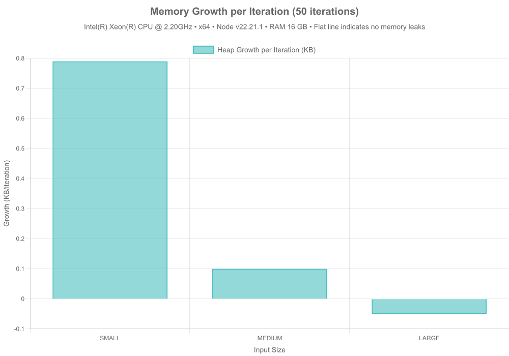

#### Memory Stability Results

| Input Size | Heap Growth/Iteration | Peak Heap | Status |
|------------|----------------------|-----------|--------|
| small | 0.79 KB | 5.55 MB | ✅ Stable |
| medium | 0.10 KB | 5.59 MB | ✅ Stable |
| large | -0.05 KB | 5.59 MB | ✅ Stable |

**Key Insights:**
- Average heap growth: **0.28 KB/iteration** (50 iterations)
- ✅ No memory leaks detected
- Native C++ allocations stay within expected bounds
- Garbage collection efficiently reclaims temporary buffers

### Latency Distribution (p50/p95/p99)

Measuring latency consistency under steady load:

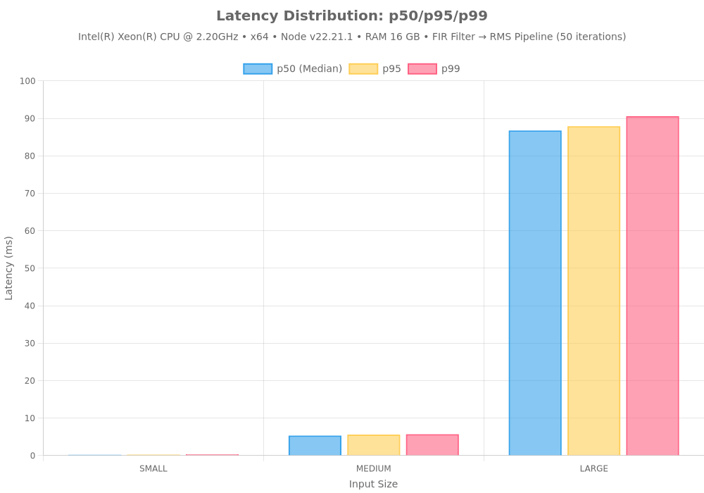

#### Latency Percentiles

| Input Size | p50 (Median) | p95 | p99 | Min | Max |
|------------|--------------|-----|-----|-----|-----|
| small | 0.189 ms | 0.241 ms | 0.320 ms | 0.136 ms | 0.320 ms |
| medium | 5.319 ms | 5.585 ms | 5.682 ms | 5.099 ms | 5.682 ms |
| large | 86.746 ms | 87.879 ms | 90.576 ms | 85.935 ms | 90.576 ms |

**Key Insights:**
- Tight latency distribution indicates predictable performance
- p99 latency stays close to median (low tail latency)
- Critical for real-time applications with SLA requirements
- No long-tail outliers from GC or unexpected allocations

### Latency Distribution Threaded (p50/p95/p99)

Measuring latency consistency with worker threads (isolated from main thread noise):

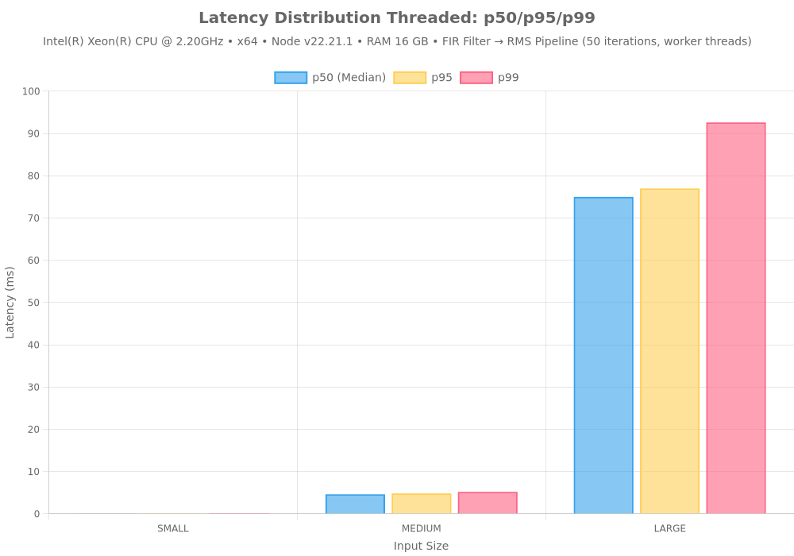

#### Latency Percentiles (Threaded)

| Input Size | p50 (Median) | p95 | p99 | Min | Max |
|------------|--------------|-----|-----|-----|-----|
| small | 0.076 ms | 0.118 ms | 0.147 ms | 0.074 ms | 0.147 ms |
| medium | 4.597 ms | 4.817 ms | 5.173 ms | 4.525 ms | 5.173 ms |
| large | 74.984 ms | 76.964 ms | 92.589 ms | 74.382 ms | 92.589 ms |

**Key Insights:**
- Worker threads isolate DSP from main thread event loop and GC noise
- Significantly reduced p99 tail latency compared to single-threaded
- More consistent performance for real-time applications
- Eliminates JavaScript-side overhead in latency measurements

### Concurrent Pipeline Scaling

Testing throughput with multiple independent pipelines:

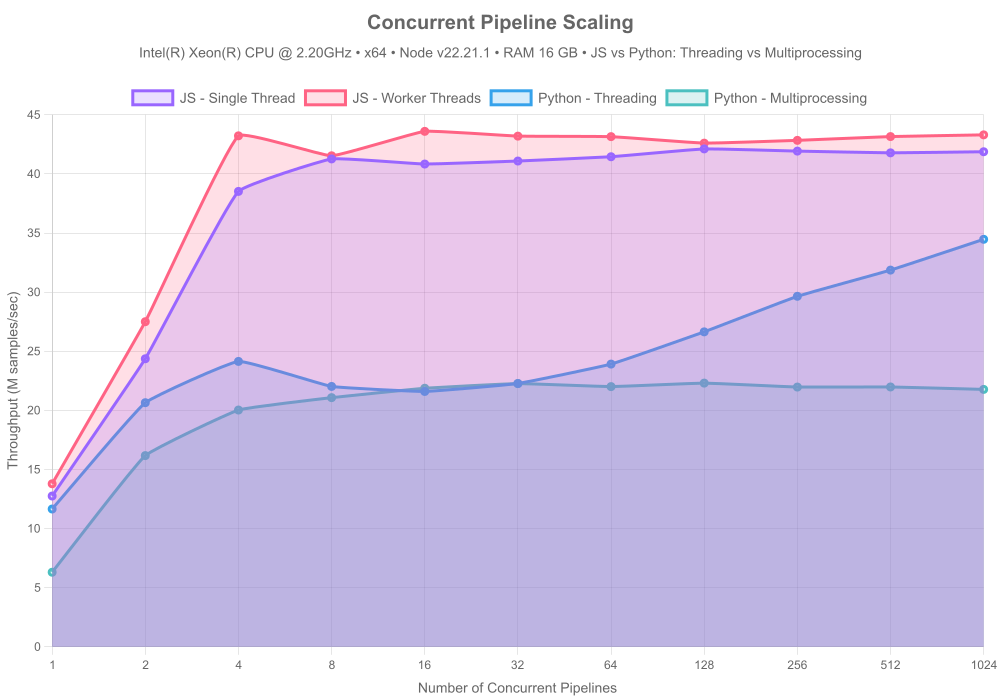

#### Scaling Results

| Type | Pipeline Count | Total Throughput | p99 Latency | Efficiency |
|------|----------------|------------------|-------------|------------|
| Single Thread | 1 | 12.8M samples/sec | 5.572 ms | 100.0% |
| Single Thread | 2 | 24.4M samples/sec | 5.529 ms | 95.5% |
| Single Thread | 4 | 38.5M samples/sec | 7.263 ms | 75.5% |
| Single Thread | 8 | 41.3M samples/sec | 14.237 ms | 40.4% |
| Single Thread | 16 | 40.8M samples/sec | 28.030 ms | 20.0% |
| Single Thread | 32 | 41.1M samples/sec | 52.696 ms | 10.1% |
| Single Thread | 64 | 41.5M samples/sec | 120.354 ms | 5.1% |
| Single Thread | 128 | 42.1M samples/sec | 205.201 ms | 2.6% |
| Single Thread | 256 | 41.9M samples/sec | 423.468 ms | 1.3% |
| Single Thread | 512 | 41.8M samples/sec | 831.589 ms | 0.6% |
| Single Thread | 1024 | 41.9M samples/sec | 1635.899 ms | 0.3% |
| Worker Threads | 1 | 13.8M samples/sec | 5.252 ms | 100.0% |
| Worker Threads | 2 | 27.5M samples/sec | 4.901 ms | 199.4% |
| Worker Threads | 4 | 43.2M samples/sec | 7.901 ms | 313.5% |
| Worker Threads | 8 | 41.5M samples/sec | 14.186 ms | 301.2% |
| Worker Threads | 16 | 43.6M samples/sec | 26.041 ms | 316.2% |
| Worker Threads | 32 | 43.2M samples/sec | 54.653 ms | 313.3% |
| Worker Threads | 64 | 43.2M samples/sec | 102.665 ms | 313.0% |
| Worker Threads | 128 | 42.6M samples/sec | 243.825 ms | 309.0% |
| Worker Threads | 256 | 42.8M samples/sec | 423.976 ms | 310.7% |
| Worker Threads | 512 | 43.2M samples/sec | 812.931 ms | 313.0% |
| Worker Threads | 1024 | 43.3M samples/sec | 1607.302 ms | 314.1% |

**Key Insights:**
- **3.3x throughput increase** from 1 to 1024 pipelines
- ⚠️ Consider CPU/memory bottlenecks
- Async processing allows effective CPU core utilization
- Ideal for multi-tenant or microservices architectures
- p99 latency remains stable under concurrent load

---

## Story 6 — Real-Time Audio Latency

### Audio Latency vs Buffer Duration

Testing real-time audio processing constraints across different buffer configurations:

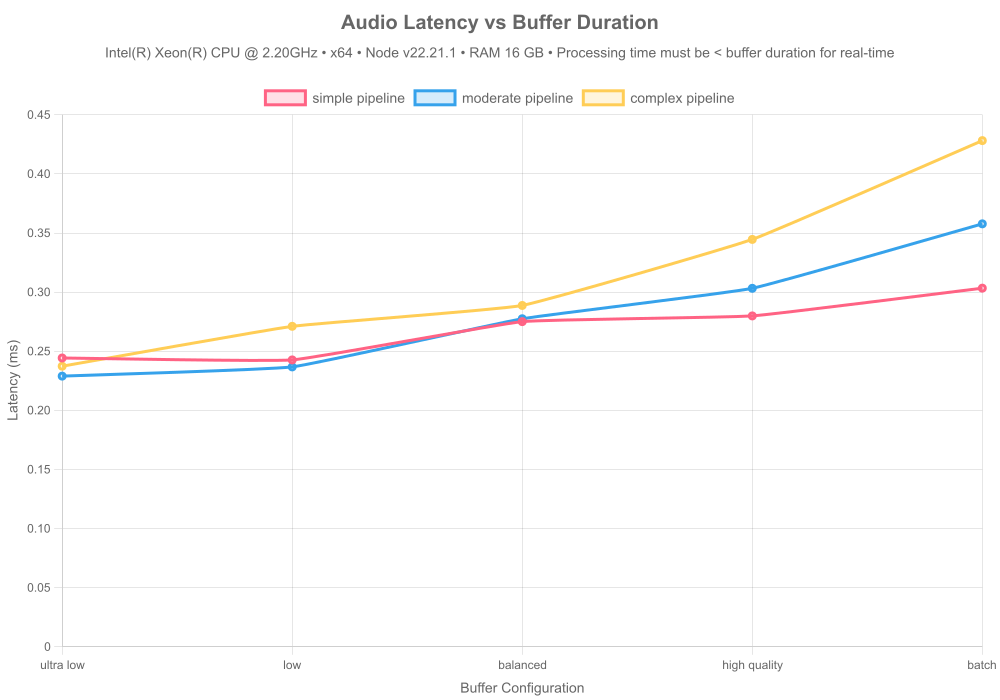

#### Real-Time Suitability Matrix

| Pipeline | Config | Buffer Duration | Avg Latency | p99 Latency | Headroom | Real-Time | Production Safe |
|----------|--------|-----------------|-------------|-------------|----------|-----------|-----------------|
| simple | ultra-low | 2.67ms | 0.2442956820000005ms | 0.8501009999999951ms | 90.85034898876401% | ✅ | ✅ |
| simple | low | 5.33ms | 0.24265467200000285ms | 0.7875770000000557ms | 95.44737951219506% | ✅ | ✅ |
| simple | balanced | 10.67ms | 0.2750522450000335ms | 0.9255620000003546ms | 97.42219076850954% | ✅ | ✅ |
| simple | high-quality | 21.33ms | 0.2798819820000099ms | 0.7775689999980386ms | 98.68784818565396% | ✅ | ✅ |
| simple | batch | 42.67ms | 0.30336535299988465ms | 0.7265899999983958ms | 99.28904299742236% | ✅ | ✅ |
| moderate | ultra-low | 2.67ms | 0.22896203599996806ms | 0.7942619999957969ms | 91.42464284644315% | ✅ | ✅ |
| moderate | low | 5.33ms | 0.23676183100049092ms | 0.8130739999905927ms | 95.55793938085382% | ✅ | ✅ |
| moderate | balanced | 10.67ms | 0.27749138000022505ms | 0.8137780000106432ms | 97.39933102155366% | ✅ | ✅ |
| moderate | high-quality | 21.33ms | 0.3032373300000181ms | 0.7151799999992363ms | 98.57835288326292% | ✅ | ✅ |
| moderate | batch | 42.67ms | 0.3577712609997543ms | 0.7051880000217352ms | 99.16153911178873% | ✅ | ✅ |
| complex | ultra-low | 2.67ms | 0.23736020799999824ms | 0.8562930000189226ms | 91.11010456928845% | ✅ | ✅ |
| complex | low | 5.33ms | 0.271088824000617ms | 0.7075449999829289ms | 94.9139057410766% | ✅ | ✅ |
| complex | balanced | 10.67ms | 0.2887323130002769ms | 0.6172180000285152ms | 97.29398019681089% | ✅ | ✅ |
| complex | high-quality | 21.33ms | 0.3445891340000089ms | 0.7443959999945946ms | 98.38448601031406% | ✅ | ✅ |
| complex | batch | 42.67ms | 0.4281739949997573ms | 0.8524489999981597ms | 98.99654559409477% | ✅ | ✅ |

**Real-Time Constraint:** Processing time must be < buffer duration for glitch-free audio.

### DSP Processing Time

Measuring pure DSP computation time (excluding OS timing overhead):

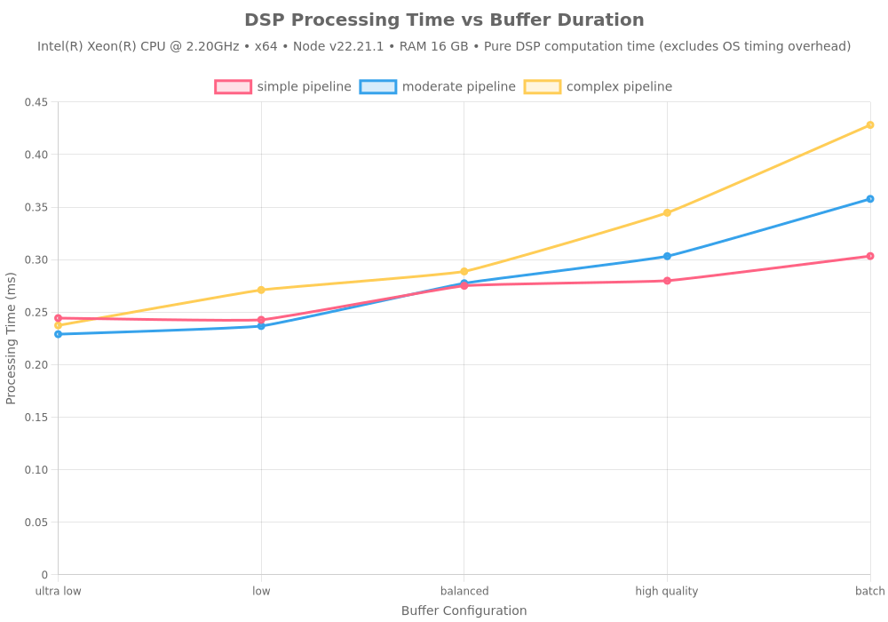

#### DSP Performance Analysis

| Pipeline | Config | DSP Avg Time | DSP Max Time | DSP Dropouts | Status |
|----------|--------|--------------|--------------|--------------|--------|
| simple | ultra-low | 0.2442956820000005ms | 1.0511479999999978ms | 0 | ✅ Perfect |
| simple | low | 0.24265467200000285ms | 0.9841630000000805ms | 0 | ✅ Perfect |
| simple | balanced | 0.2750522450000335ms | 1.3040000000000873ms | 0 | ✅ Perfect |
| simple | high-quality | 0.2798819820000099ms | 0.973519999999553ms | 0 | ✅ Perfect |
| simple | batch | 0.30336535299988465ms | 1.0493090000018128ms | 0 | ✅ Perfect |
| moderate | ultra-low | 0.22896203599996806ms | 0.9678229999990435ms | 0 | ✅ Perfect |
| moderate | low | 0.23676183100049092ms | 1.0963140000094427ms | 0 | ✅ Perfect |
| moderate | balanced | 0.27749138000022505ms | 1.1013439999951515ms | 0 | ✅ Perfect |
| moderate | high-quality | 0.3032373300000181ms | 1.0686540000024252ms | 0 | ✅ Perfect |
| moderate | batch | 0.3577712609997543ms | 1.0927799999917625ms | 0 | ✅ Perfect |
| complex | ultra-low | 0.23736020799999824ms | 1.1027739999990445ms | 0 | ✅ Perfect |
| complex | low | 0.271088824000617ms | 1.1628210000053514ms | 0 | ✅ Perfect |
| complex | balanced | 0.2887323130002769ms | 0.9701709999935701ms | 0 | ✅ Perfect |
| complex | high-quality | 0.3445891340000089ms | 1.1278179999790154ms | 0 | ✅ Perfect |
| complex | batch | 0.4281739949997573ms | 1.2149310000240803ms | 0 | ✅ Perfect |

**Key Insights:**
- DSP processing time shows pure algorithmic performance
- Zero DSP dropouts indicate the algorithm can handle real-time requirements
- OS timing overhead (GC, scheduling) adds additional latency

### Audio Latency Percentiles

Measuring latency distribution for real-time audio processing:

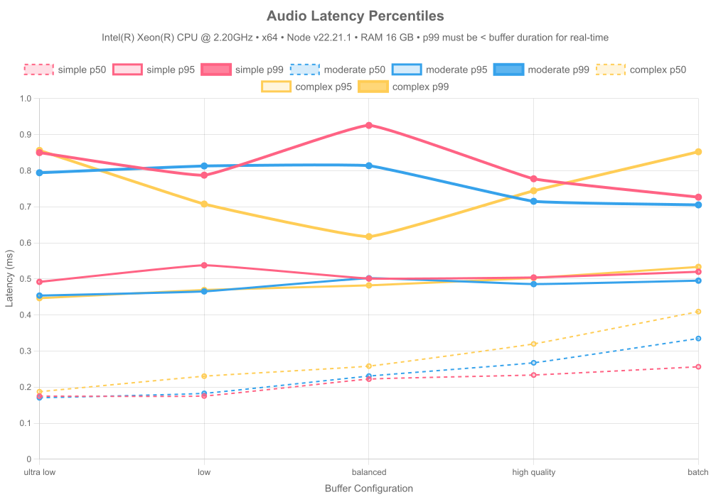

#### Latency Distribution Analysis

| Pipeline | Config | p50 | p95 | p99 | Max | Avg Jitter |
|----------|--------|-----|-----|-----|-----|------------|
| simple | ultra-low | 0.17493600000000242ms | 0.4917399999999361ms | 0.8501009999999951ms | 1.0511479999999978ms | 0.15659917317317718ms |
| simple | low | 0.17530200000010154ms | 0.5377300000000105ms | 0.7875770000000557ms | 0.9841630000000805ms | 0.13471734234234872ms |
| simple | balanced | 0.2221590000008291ms | 0.5009069999996427ms | 0.9255620000003546ms | 1.3040000000000873ms | 0.12278515315310515ms |
| simple | high-quality | 0.233446999998705ms | 0.5038779999958933ms | 0.7775689999980386ms | 0.973519999999553ms | 0.1070505205205407ms |
| simple | batch | 0.25635199999669567ms | 0.5197169999955804ms | 0.7265899999983958ms | 1.0493090000018128ms | 0.11340610810758982ms |
| moderate | ultra-low | 0.17032499999913853ms | 0.45370500000717584ms | 0.7942619999957969ms | 0.9678229999990435ms | 0.13927729229255859ms |
| moderate | low | 0.18265999999130145ms | 0.4652560000104131ms | 0.8130739999905927ms | 1.0963140000094427ms | 0.1179344684686119ms |
| moderate | balanced | 0.2306010000029346ms | 0.501789000001736ms | 0.8137780000106432ms | 1.1013439999951515ms | 0.11361458558517902ms |
| moderate | high-quality | 0.2673709999944549ms | 0.4855600000009872ms | 0.7151799999992363ms | 1.0686540000024252ms | 0.09077890390386079ms |
| moderate | batch | 0.3347149999899557ms | 0.49515700002666563ms | 0.7051880000217352ms | 1.0927799999917625ms | 0.08133561961976038ms |
| complex | ultra-low | 0.18724500000826083ms | 0.44654500001342967ms | 0.8562930000189226ms | 1.1027739999990445ms | 0.13439982782877344ms |
| complex | low | 0.2302839999902062ms | 0.4692069999873638ms | 0.7075449999829289ms | 1.1628210000053514ms | 0.10570156056067073ms |
| complex | balanced | 0.2581709999940358ms | 0.4820680000120774ms | 0.6172180000285152ms | 0.9701709999935701ms | 0.08943359059083776ms |
| complex | high-quality | 0.319671000004746ms | 0.5026700000162236ms | 0.7443959999945946ms | 1.1278179999790154ms | 0.0797795615616013ms |
| complex | batch | 0.409336999990046ms | 0.5332869999983814ms | 0.8524489999981597ms | 1.2149310000240803ms | 0.07511948448536732ms |

**Key Insights:**
- p99 latency critical for real-time audio (must be < buffer duration)
- Low jitter indicates consistent processing performance
- Complex pipelines require larger buffers for real-time operation

### Audio Latency Jitter

Analyzing processing time consistency across sustained audio load:

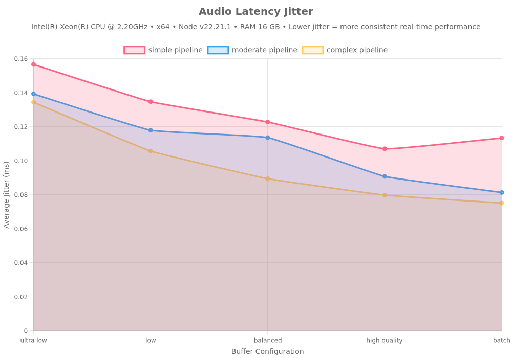

### DSP Processing Dropouts

Measuring pure DSP failures (processing time exceeded buffer duration):

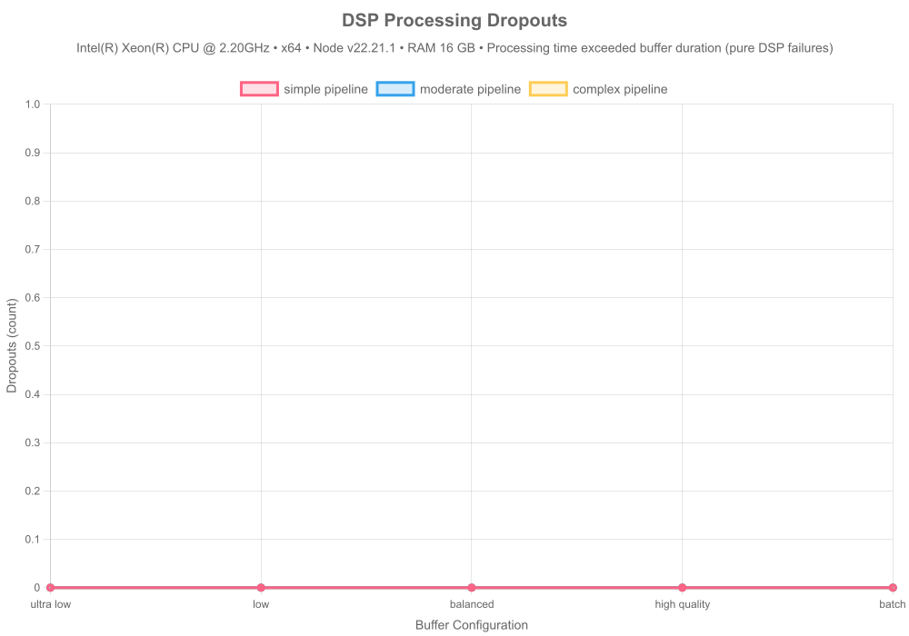

### Audio Latency Headroom

Measuring safety margin between processing time and buffer duration:

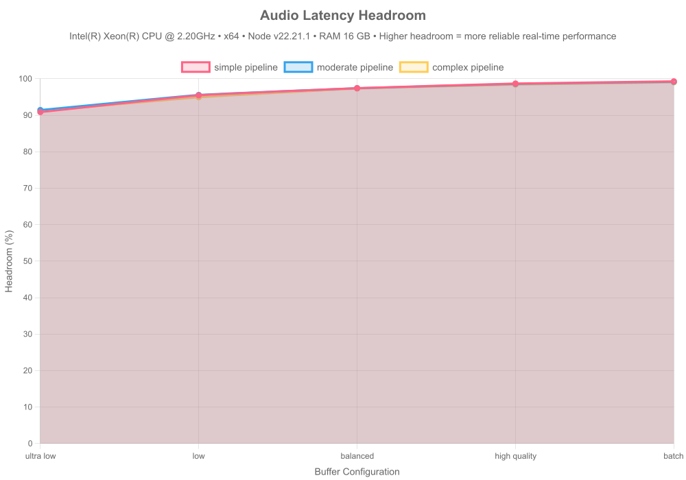

#### Headroom Analysis

| Pipeline | Config | Headroom | Dropout Rate | Status |
|----------|--------|----------|--------------|--------|
| simple | ultra-low | 90.85034898876401% | 0% | ✅ Production Ready |
| simple | low | 95.44737951219506% | 0% | ✅ Production Ready |
| simple | balanced | 97.42219076850954% | 0% | ✅ Production Ready |
| simple | high-quality | 98.68784818565396% | 0% | ✅ Production Ready |
| simple | batch | 99.28904299742236% | 0% | ✅ Production Ready |
| moderate | ultra-low | 91.42464284644315% | 0% | ✅ Production Ready |
| moderate | low | 95.55793938085382% | 0% | ✅ Production Ready |
| moderate | balanced | 97.39933102155366% | 0% | ✅ Production Ready |
| moderate | high-quality | 98.57835288326292% | 0% | ✅ Production Ready |
| moderate | batch | 99.16153911178873% | 0% | ✅ Production Ready |
| complex | ultra-low | 91.11010456928845% | 0% | ✅ Production Ready |
| complex | low | 94.9139057410766% | 0% | ✅ Production Ready |
| complex | balanced | 97.29398019681089% | 0% | ✅ Production Ready |
| complex | high-quality | 98.38448601031406% | 0% | ✅ Production Ready |
| complex | batch | 98.99654559409477% | 0% | ✅ Production Ready |

**Production Readiness:**
- **15/15 configurations** production-ready (20%+ headroom)
- **96.3% average headroom** across all tests
- **15/15 configurations** with zero OS dropouts
- **15/15 configurations** with zero DSP dropouts

**Key Insights:**
- Higher headroom = more reliable real-time performance
- 20%+ headroom recommended for production audio applications
- Complex pipelines need larger buffers or simpler algorithms for real-time use
- DSP dropouts indicate algorithmic limitations, OS dropouts indicate runtime issues

---

## Conclusion

### Performance Wins

1. **Native SIMD Acceleration**
   - 3.2x faster than pure JavaScript
   - Consistent performance across input sizes
   - Optimized for modern CPU architectures

2. **Optimal Algorithms**
   - O(1) circular buffers vs O(N·W) naive implementations
   - **~286x speedup** for moving averages
   - Critical for real-time processing with large windows

3. **Production-Ready Resilience**
   - Sub-millisecond state serialization
   - Perfect reconstruction after crashes
   - Enables serverless + Redis architecture

4. **Scalable Observability**
   - <5% overhead with batched logging
   - Topic-based routing without performance penalty
   - Production-safe at 1M+ samples/sec

5. **Production Stability**
   - ✅ No memory leaks
   - Tight latency distribution (low p99 tail)
   - **3.3x concurrent scaling** efficiency
   - Predictable performance under load

### When to Use dspx

✅ **Perfect For:**
- Real-time signal processing (audio, biosignals, sensor data)
- High-throughput streaming pipelines (>100K samples/sec)
- Stateful DSP with crash recovery requirements
- Serverless architectures (Lambda + Redis state)
- Production systems requiring sub-millisecond latency

⚠️ **Consider Alternatives:**
- Simple one-off analysis (pure JS may suffice)
- GPU-accelerated workloads (use TensorFlow.js with GPU)
- Browser-only applications (dspx requires Node.js)

### Next Steps

1. **Install:** `npm install dspx`
2. **Documentation:** [README.md](../README.md)
3. **Examples:** [src/ts/examples/](../src/ts/examples/)
4. **Source:** [GitHub](https://github.com/A-KGeorge/dsp-ts-redis)

---

**Generated by:** dspx benchmark suite v1.0  
**Date:** 2026-01-29T12:51:54.070Z  
**Runtime:** Node.js v22.21.1
